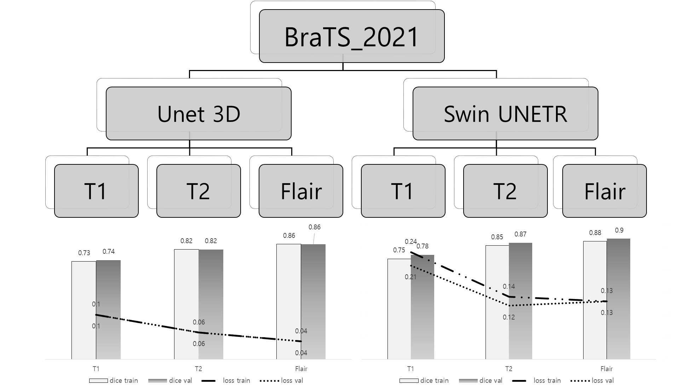

"3D segmentation" 

# 1. Dataset : BraTS(Brain Tumor Segmentation)2021

- MRI 3D img file(.nii) 로 약 1600명의 환자가 있음
- 촬영기법은 T1, T2, Flair가 있음
- 각 촬영기법의 특징:
    - **T1 :** 해부학적 구조를 잘 보여주며, 지방조직이 밝게 나타나고 물은 어둡게 나타남
    - **T2 :** 병변이나 부종을 잘 보여주며, 물이 밝고 지방조직은 중간 정도의 신호강도를 보임
    - **FLAIR :** 뇌척수액의 신호를 억제, 뇌실주변의 병변을 더 명확하게 보여주는 특수 촬영기법
    
    
    
- Lable 은 총 3가지
    - Enhancing Tumor, Tumor Core, Whole Tumor
    - 암이 얼마나 진행 정도에 따른 분류임
    - 현재 Project에서 Label은  종양의 유무만 판단함(multi-label로 진행 시, 성능이 너무 안나옴)

# 2. Preprocessing

- Single Modal(T1, T2, flair)
- Augmentation
    - RandomAffin
    - RandomFlip
- Aug 후가 훨씬 더 잘 잡는 것을 알 수 있음.

# 3. Loss

DiceLoss → Focal Tversky Loss 

[Focal Tversky Loss]

- **Focal Tversky Loss**는 주로 의료 영상 분할 같은 불균형 데이터 문제에서 높은 성능을 보이도록 설계된 손실 함수.
- 성능지표가 오히려 낮아지고, Loss값도 조금 낮아짐, 큰 차이를 느끼지는 못함

# 4. Result

[3D UNET Result](img/3d4_1.png)

- 33번 환자 sample로 Axial, Coronal로 찍어봄

- 가장 성능 좋은 촬영기법은 Flair임
- T2, Flair 는 T1에 비해 성능이 좋음
- T1사진을 분석해 보면, Aug를 하였을 때, 성능을 더 좋음 , Focal-Tversky loss 별차이 없어보임

# 5. Model (Unet3D → SwinUNETR)

[Swin UNETR](img/3d5_1.png)

### **Swin UNETR란?**

- **Swin Transformer**와 **UNETR**의 장점을 결합한 의료 영상 분할 모델임.
    - **Swin Transformer**: 이미지 처리에 효율적인 **비전 트랜스포머(Vision Transformer)**로, 국소적(local) 및 전역(global) 특징을 동시에 학습할 수 있는 구조를 제공함.
    - **UNETR (UNet with Transformers as Encoder-Decoder Representation)**: Transformer를 UNet 구조의 인코더로 사용하여, 전역적인 문맥 정보를 효과적으로 학습하면서도 높은 해상도의 출력 결과를 제공함.
### **Swin UNETR 구조 (Architecture)**

1. **인코더(Encoder)**:
    - Swin Transformer를 사용하여 입력 영상의 **다중 스케일 특징**을 학습함.
    - 트랜스포머의 **Self-Attention** 메커니즘을 활용해 전역적 문맥 정보를 효과적으로 학습함.
2. **디코더(Decoder)**:
    - UNETR처럼 점진적으로 높은 해상도를 복원하여 세밀한 분할 결과를 생성함.
    - 인코더의 다중 스케일 특징을 skip connection을 통해 디코더로 전달함.
3. **Skip Connections**:
    - UNet 구조의 주요 요소로, 고해상도 공간 정보를 인코더에서 디코더로 직접 전달하여 세밀한 출력 이미지를 생성할 수 있도록 도움.

- 결과값 비교

- 가장 잡는 촬영기법은 FLAIR > T2 > T1
- Swin UNETR 이 T1 보다 성능이 조금 더 좋음
- 33번 환자를 기준으로 Coronal 사진을 보았을 경우 큰차이를 느끼지는 못함

# 6. AFFINE (Automated Anatomical Labeling사용)

- **Affine 변환**은 뇌 영상 데이터를 **표준 좌표계**에 맞추기 위한 변환 방법입니다.
- **AAL**: 뇌를 여러 해부학적 영역으로 나눈 지도
- **Affine 변환**: 개별 뇌 영상 데이터를 회전, 이동, 크기 조정 등을 통해 이 표준 지도(AAL 템플릿)와 맞추는 과정입니다. 즉, 환자의 뇌 영상을 AAL 템플릿과 정렬해 **비교하거나 분석하기 쉽게 만드는 과정**입니다. 쉽게 말해, **뇌 사진을 표준 지도에 맞게 위치와 크기를 조정**한다고 생각하면 됨.

# 7. Unet3D vs SwinUNETR의  Affin transform Result

[AFFIN Transform Result](img/3d7_1.png)

- 위 자료를 이해하기 쉽게 표현해봄

- Label을 100%로 가정했을 때, Unet3D 는 Label data보다 약 75% 크게 예측함
- SwinUNETR은 약 10% 정도 크게 예측함
- 두가지 결론을 도출해 볼 수 있음
    - Swin UNETR의 model 에서 pool 단계에서 transformer가 들어가서 더욱 정교하게 예측한거라 사료됨
    - Unet3D의 loss 값이 Dice가 아닌 Focal-Tversky loss값을 사용함 (Swin UNETR은 Dice적용)
        
        Focal - Tversky loss 가 작은객체를 탐지할 떄 더욱 큰 가중치를 부여하는 loss값임.
        
        때문에 종양이 더 크게 잡히지 않았나 사료됨
        
    - SwinUNETR은 Focal - Tversky loss 적용하지 못함(시간부족)

[Failure](https://www.notion.so/Failure-163c4cba74ea80868172d4f24a21215f?pvs=21)
