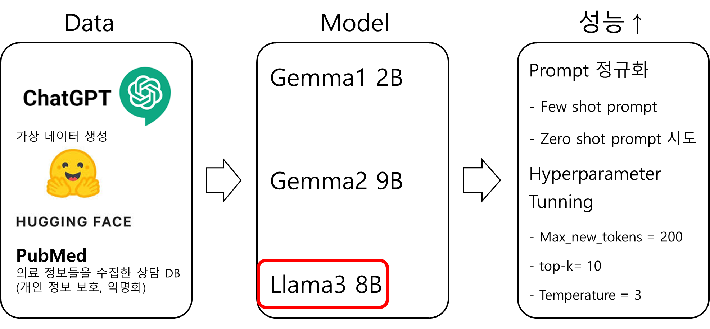

"# Brats" 

## 1. Service inform

3D segmentation , Rag 와 다르게 독립적으로 진행함

- 목적 : 환자와 과거 대화기록 Data를 기반으로 소견서 생성
- Data :
    - 실제 환자정보 및 소견서 확보가 어려워 GTP를 통해 가짜 DATA를 만듬
    - Hugging face에 있는 환자-의사 대화기록 확보
    - 두가지 Source 를 사용하여 소견서 생성
- Model:
    - Gemma1 2B : 할루시네이션 다수 발생, 중요데이터를 받아오지 않음
    - Gemma2 9B : 상세한 표현과 절차, 맥락에 대한 언급
    - Llama3 8B : 표현에 있어서 간결하고 핵심정보 위주로 전달, 환자의 과거 병력에 대해 명확하게 언급
    - **결론 : Gemma2 는 해부학적표현 기술적 표현이 더 많고, Llama3 8B 는 환자의 상태와 주요 절차에 대해 설명하여 소견서에는 Llama3 이 더 적합하다 판단됨**
- 성능 개선 전략
    - Prompt 정교화
        - **Few-shot 문제점:**
            - 예시값이 일정할 경우, 결과값도 편향적으로 생성됨.
            - 예: “유진이와 원영이가 7시에 일어난다”는 예시를 제공하면 항상 7시로 결과값이 고정됨.
        - **결론:**
            - **예시를 교체하거나 참고용임을 명시하여 다양성을 유도.**
            - **Zero-shot 방식은 형식의 일관성을 줄이는 대신, 다소 예측 불가능한 결과를 얻을 수 있음.**
    - Hyperparameter tunning
        - Max_new_tokens : 생성된 문장길이를 정하는 값, 너무 짧게 하면 문장이 짤리는 현상이 발생함
        - topk : 일반적으로 5~50정도의 값을 가짐. 숫자가 작으면 같은 단어만 반복하는 현상 발생, 너무 크면 엉뚱한 데이터 생성. **결과적으로 10으로 고정**
        - temparature : topk와 비슷학게, 창의성과 일관성을 조절하는 수치로, 낮을수록 일관적인 답변을 생성. **결과적으로 0.3으로 고정**
