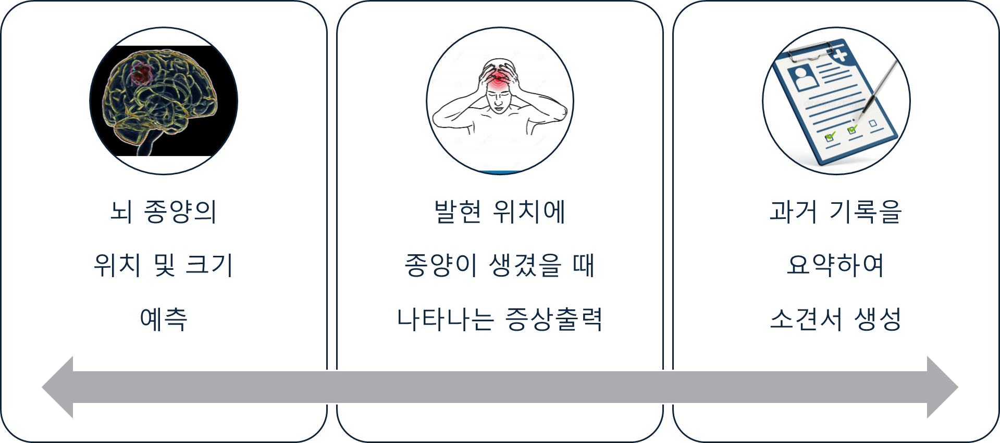

"# Brats" 

## 1. Service inform

- 뇌 종양의 위치 및 Size를 예측하여 해당 부위에 이상이 생겼을 경우, 나타나는 증상을 알려줌
- 과거 기록을 바탕으로 소견서 생성해줌
- 두 가지 기능을 종합, web으로 구현하여 Service를 제공

## 2. Service Pipeline

- Segmentation : 종양의 3D img & 위치 및 Size 출력
- Rag : Segmentation 에서 위치 및 Size data를 받아 Neurology PDF에서 찾음 → 증상출력
- LLM : 과거 진단기록 요약하여 소견서 생성

## 3. Service output

## 4. 기술별 workflow

[3D Segmentation](https://www.notion.so/3D-Segmentation-162c4cba74ea809184d7d40e0fd3ff51?pvs=21)

[Rag](https://www.notion.so/Rag-162c4cba74ea809aa02bfc3cc8d7069e?pvs=21)

[LLM](https://www.notion.so/LLM-162c4cba74ea80488745d9b4d9eab264?pvs=21)

## 5. Tech & Member

## Time line

