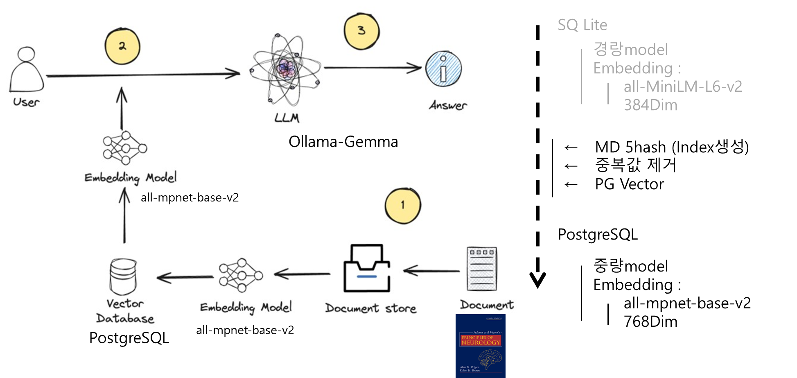

"# Brats" 

## 1. Service inform

- 목적 : 3D segmentation 의 predict 결과물에서 종양이 있을 때 증상 출력
- Workflow
    - Neurology PDF를 vector화 하여 SQL DB에 저장
    - 3D Segmentation 의 output(종양 위치 및 size)를 받음
    - Ollima 를 사용하여  해당 병변 의 증상 출력
- SQ Lite → PostgreSQL (RAG 성능 UP 위하여 변경)
    - vecotor화 시킬 때 embedding model 변경
        
        all-MiniLLM-L6-v2(384dim) → all mpnet-base-v2(768dim)
        
    - PstagreSQL 은 vector DB처리 시 PG Vector사용
